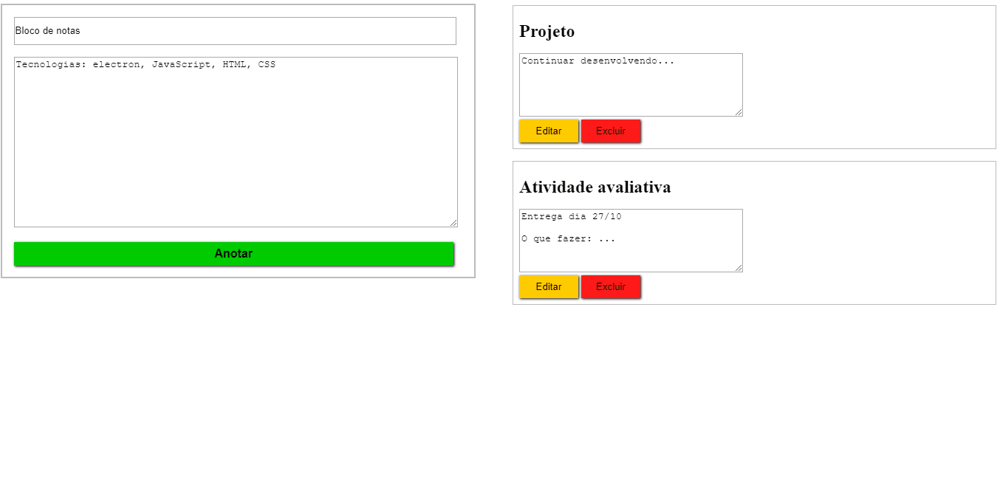

<h1 align="center">

</h1>

<h1>

</h1>

## 📝 Sobre:

O projeto é um **bloco de notas**, onde permite o cadastro, alteração e exclusão de uma nota. O desenvolvimento é inspirado em um vídeo do youtube: https://www.youtube.com/watch?v=0h2LBY5M8y4. 

---

## 🚀 Tecnologias utilizadas

O projeto foi desenvolcido utilizando as seguintes tecnologias:

- HTML
- CSS
- JavaScript
- [ElectronJs](https://www.electronjs.org/)
- [Mysql](https://www.mysql.com/)

---

## 📦 Como baixar o projeto

```bash

    # Clonar o repositório
    $ git clone https://github.com/mlemos07/CRUD_BLOCO_DE_NOTAS.git

    # Instalar as dependências
    $ npm install

    # Iniciar o projeto
    $ npm start

```

---

## ⚠ Observações:

- Você precisará de um banco de dados. As instruções para o banco estão no arquivo ***'sql.db'***, que estão na pasta ***'sql'*** ;
- Ao construir o banco, verifique na página ***'database.js'*** se a porta ***'port'*** utilizada está disponível na sua máquina, caso contrário, é necessária a edição da mesma. 

---

Desenvolvido por Marianna Lemos 💛.

